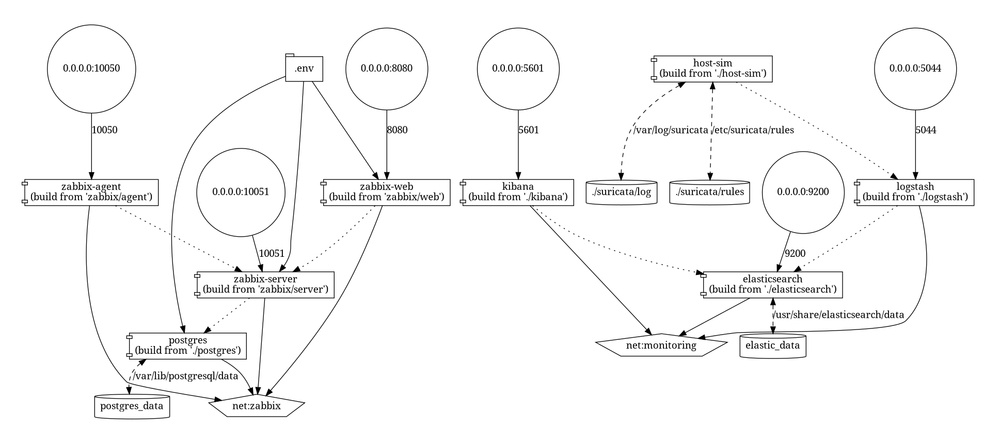
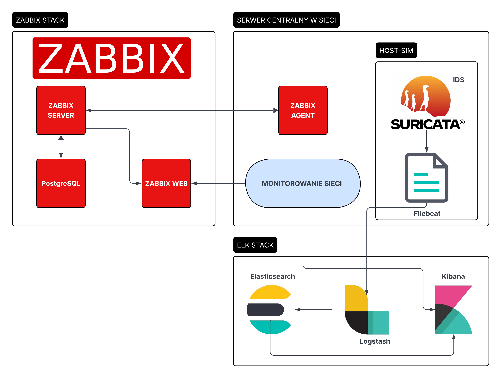

Stos ELK (Elasticsearch Logstash Kibana): działają w pełni w kontenerach zbierając logi Suricaty od hosta poprzez połączenie Filebeat -> Logstash i udostępniając je do przeglądu w Kibanie (aktualnie nie mam przygotowanych dashboardów do moich danych).

Stos Zabbix: Agent zabbix zbiera informacje odnośnie urządzenia na którym jest uruchomiony (zużycie zasobów, obciążenie itd.). Na potrzeby prezentacji działania jest uruchamiany z oficjalnego obrazu w koneterze monitorując sprzętowo zasoby przydzielone dla dockera. W środowiski rzeczywistym jest zainstalowany na hoście.

HOST-SIM: symuluje hosta środowiska rzeczywistego w celu prezentacji logów zbieranych przez Suricate na interfejsie sieciowym hosta uruchamiającego kontenery. Docelowo jest ona zainstalowana bezpośrednio na hoście razem z usługą Filebeat do przesyłania eve.json do ELK.

github: https://github.com/stasiuwa/network-monitoring

dockerhub: https://hub.docker.com/repositories/stasiuwa

nie ma deploy, ograniczenia zasobów, wywalic userów w dockerfile'ach i dodach healthchecki, dodać secrety, czy wszystko pojdzie spiac na http, moze jaksi loadbalancer albo reverse proxy, zabezpieczeony transport do wolumenów - nie NFS, znalezc jakis inny system plików bo nfs przesyła gołe dane i łatwo mozna podsłuchać, 